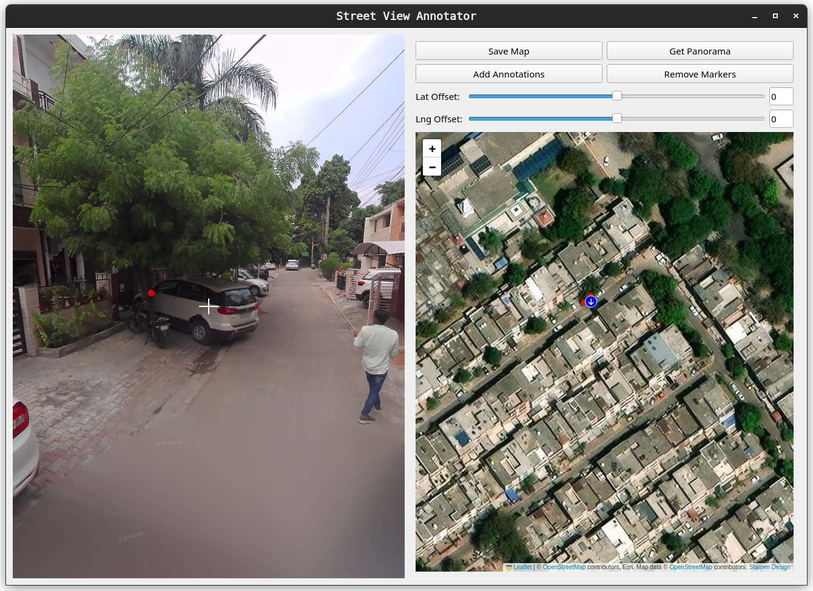

# Annotator

Simple annotator tool used to annotate Street View Images for Tree Inventorization Project under Professor Anupam Sobti at Plaksha University. Built on top of work done [here](https://github.com/Frozensun47/Street-View-Annotator), but **heavily refactored and updated for our specific usecase**.


## Table of Contents

- [Recent Updates](#Updates)
- [Installation and Run](#installation-and-run)
- [Tutorial](#tutorial)
- [App Overview](#app-overview)
  - [Street View Display](#street-view-display)
  - [Buttons](#side-buttons-and-sliders)
  - [Aerial View Map](#aerial-view-map)
- [To-do/ Issues/ bugs](#issues-pending-work)
- [Acknowledgment](#Acknowledgment)


## Updates

- Added sliders to offset depth bias while annotations
- Added ease of access features to make annotations easier
- Sidebar has been removed.
- Database can now be written to


## Installation and Run

```bash
# Open a terminal and clone the repository
git clone https://github.com/coolperson111/Street-View-Annotator
# Change directory to the cloned repository
cd Street-View-Annotator

# If you have Conda installed, create and activate the environment
# If you don't want to use Conda, skip these two lines or use suitable alternative
conda create --name annotator python=3.10.10
conda activate annotator

# Install dependencies from requirements.txt
pip install -r requirements.txt

# Add depth maps
mkdir -p data/Depth_maps
wget -P data/Depth_maps/ https://github.com/Frozensun47/Street-View-Annotator/blob/main/data/Depth_maps/numpy_depth.npy

# To Run the annotator
./run.sh
```


## Tutorial



After opening the app, follow these steps:

1. Go to the aerial view map(on the right) and navigate to desired location.
2. Left-click to drop a marker on the  specific location.
3. Click the "Get Panorama Image" button to load the corresponding street view panorama.
    (the street view display should now be changed with new panorma)
4. In the street view display(on the left), left-click to enter, move the mouse to navigate, and right-click to drop markers(in the street view display).
5. "Add annotations" button to stage the annotation.
6. "Save map" button to save to database


## App Overview

The app consists of three main components:

### Street View Display

In the left, there is the street view display with functionalities:

- **Pan:** Hold and move Left-click inside the street view display area and move the mouse. Scroll up and down to set the FOV.
- **Add Markers:** Right-click to add markers.
- **'z':** Undo an added marker
- **'j':** Move to stview image in the direction of the crosshair

### Side Buttons and Sliders

On the top right side, there are various buttons:

- **Save Map:** Saves all current staged/reviewed annotations to the database
- **Add Annotations:** Adds all annotations from Street-View into the aerial view for staging and review
- **Get Panorama:** Fetches the panorama of the last placed marker on the map and shows it to the street view display.
- **Remove Markers:** Removes all markers on aerial map
- **Lat/Lng Offset Sliders:** Offsets all annotations' latlng to account for depth bias and error in depth maps, updates on aerial map

### Aerial View Map

Functionalities:
- Left-click and drag to move/navigate the map.
- Scroll to zoom in and out.
- Double-click to place a marker.
- Double-click a marker to remove it.
- Click once on a marker to get its latitude and longitude.
- Use + and - symbols to zoom in and out.
- Drag markers and annotations to change their position, and correct them.

## Issues / pending work

- [ ] migrate to ORM to make db connection robust, and easy to use on all machines
- [ ] ANNOTATE LOTS OF IMAGES - seattle?


## Acknowledgment

[Original Repo](https://github.com/Frozensun47/Street-View-Annotator)

Developers: [Utkarsh Agarwal](https://github.com/Utk984), [Malhar Bhise](https://github.com/coolperson111)  
Additional Help: [Abhiraaj Sharma](https://github.com/AbhiraajSharma)

This project was undertaken in collaboration with the [Geospatial Computer Vision Group](https://anupamsobti.github.io/geospatial-computer-vision/) led by [Dr. Anupam Sobti](https://anupamsobti.github.io/). We are grateful for the support and guidance provided throughout the development of this project.
